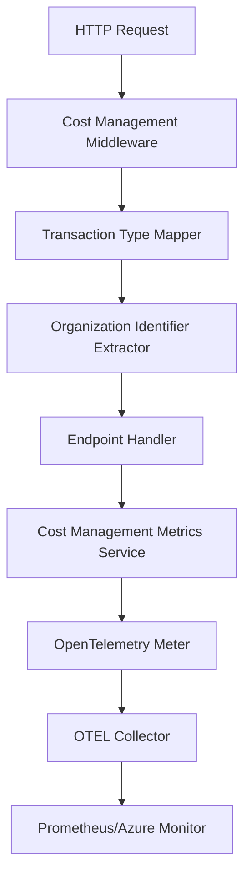

# Cost Management Metrics

This document describes the implementation of cost management metrics in Dialogporten as specified in [Issue #2376](https://github.com/Altinn/dialogporten/issues/2376).

## Overview

The cost management metrics system tracks dialog transactions for billing and cost analysis purposes. It records metrics for successful operations (2xx status codes) and client errors (4xx status codes), but excludes server errors (5xx) as they don't incur costs.

## Architecture

### Components

1. **CostManagementMetricsService**: Core service that emits OpenTelemetry metrics
2. **TransactionTypeMapper**: Maps HTTP requests to transaction types
3. **ServiceIdentifierExtractor**: Extracts organization identifiers from requests
4. **CostManagementMiddleware**: Automatically captures metrics for all requests

### Data Flow



## Transaction Types

The system tracks 12 different transaction types:

| Transaction Type | Description | Norwegian Term |
|------------------|-------------|----------------|
| `CreateDialog` | Create dialog operation | Opprette dialog |
| `UpdateDialog` | Update dialog operation | Oppdatere dialog |
| `SoftDeleteDialog` | Soft delete dialog operation | Softslette dialog |
| `HardDeleteDialog` | Hard delete/purge dialog operation | Hardslette dialog |
| `GetDialogServiceOwner` | Get dialog by service owner | Hente dialog tjenesteeier |
| `SearchDialogsServiceOwner` | Service owner search dialogs | Tjenesteeiersøk |
| `SearchDialogsServiceOwnerWithEndUser` | Service owner search with end user ID | Tjenesteeiersøk m/sluttbruker-id |
| `GetDialogEndUser` | Get dialog by end user | Hente dialog sluttbruker |
| `SetDialogLabel` | Set label on single dialog | Sette label på enkeltdialog |
| `BulkSetLabelsServiceOwnerWithEndUser` | Bulk set labels via service owner API | Bulk label setting with end user |
| `SearchDialogsEndUser` | End user search dialogs | Sluttbrukersøk |
| `BulkSetLabelsEndUser` | Bulk set labels via end user API | Bulk label setting end user |

## Metrics Schema

### Counter Metric

- **Name**: `dialogporten_transactions_total`
- **Description**: Total number of dialog transactions for cost management
- **Type**: Counter (incremental)

### Tags

| Tag Name | Description | Example Values |
|----------|-------------|----------------|
| `transaction_type` | Type of transaction | `CreateDialog`, `GetDialogServiceOwner` |
| `org` | Organization identifier | `991825827`, `null` |
| `status` | Success/failure status | `success`, `failed` |
| `http_status_code` | HTTP response status code | `200`, `201`, `400`, `404` |
| `environment` | Environment name | `Development`, `Test`, `Production` |

## Route Mapping

The system automatically maps HTTP requests to transaction types based on:

- HTTP method (GET, POST, PUT, DELETE, PATCH)
- Request path pattern
- Presence of `enduserid` query parameter

### Examples

| HTTP Request | Transaction Type |
|-------------|------------------|
| `POST /api/v1/serviceowner/dialogs` | `CreateDialog` |
| `GET /api/v1/serviceowner/dialogs/{id}` | `GetDialogServiceOwner` |
| `GET /api/v1/serviceowner/dialogs?enduserid=...` | `SearchDialogsServiceOwnerWithEndUser` |
| `GET /api/v1/enduser/dialogs/{id}` | `GetDialogEndUser` |
| `DELETE /api/v1/serviceowner/dialogs/{id}` | `SoftDeleteDialog` |

## Implementation Approaches

The system provides two complementary approaches for recording metrics:

### 1. Automatic Middleware (Recommended)

The `CostManagementMiddleware` automatically captures metrics for all API requests:

- Maps requests to transaction types
- Extracts organization identifiers
- Records metrics with proper tags
- Handles errors gracefully

### 2. Manual Endpoint Integration

Individual endpoints can also record metrics directly:

```csharp
_metricsService.RecordTransaction(
    TransactionType.CreateDialog, 
    StatusCodes.Status201Created, 
    orgIdentifier);
```

This approach provides more control and can include additional context not available to middleware.

## Organization Identifier Extraction

Organization identifiers represent the **organization making the API call** and are extracted from:

1. **User Claims**: Organization number from the authenticated user's `consumer` claim
2. **Service Owner Operations**: Extracts organization number when authenticated as service owner
3. **End User Operations**: Returns `null` as specified (no organization context)

For operations where no organization can be determined (e.g., end user searches, unauthenticated requests), the org tag is set to `"null"`.

### Authentication Flow
- **Service Owner**: `consumer` claim contains organization number (e.g., "991825827")
- **End User**: No organization context, organization identifier is `null`
- **Unauthenticated**: Organization identifier is `null`

## Configuration

### Registering Services

In `Program.cs`:

```csharp
builder.Services.AddCostManagementMetrics();
```

### Adding Middleware

In `Program.cs`:

```csharp
app.UseCostManagementMetrics();
```

### OpenTelemetry Integration

The cost management meter is automatically registered in the OpenTelemetry configuration:

```csharp
metrics.AddMeter("Dialogporten.CostManagement");
```

## Local Testing

### Prerequisites

1. Start the OTEL collector: `docker-compose -f docker-compose-otel.yml up`
2. Run the WebApi: `dotnet run --project src/Digdir.Domain.Dialogporten.WebApi`

### Viewing Metrics

1. **Prometheus**: http://localhost:8889/metrics
2. **Search for**: `dialogporten_transactions_total`

### Test Requests

Use the provided `test-cost-metrics.http` file to generate test transactions and verify metrics collection.

### Example Metrics Output

```
# Example metrics with the new "org" tag
dialogporten_dialogporten_transactions_total{
  transaction_type="GetDialogServiceOwner",
  org="991825827",
  status="success",
  http_status_code="200",
  environment="Development"
} 14

dialogporten_dialogporten_transactions_total{
  transaction_type="CreateDialog",
  org="991825827", 
  status="success",
  http_status_code="201",
  environment="Development"
} 5

dialogporten_dialogporten_transactions_total{
  transaction_type="SearchDialogsEndUser",
  org="null",
  status="success", 
  http_status_code="200",
  environment="Development"
} 3
```

## Production Considerations

### Performance

- Metrics collection uses OpenTelemetry's efficient counter implementation
- Minimal overhead on request processing
- Automatic batching and export handled by OTEL

### Reliability

- Middleware handles errors gracefully without affecting request processing
- Failed metric collection is logged but doesn't impact API functionality
- Organization extraction handles authentication failures gracefully

### Monitoring

Monitor the cost management metrics system itself by:

- Checking for metric collection errors in application logs
- Verifying metric export to monitoring systems
- Alerting on missing or unexpected metric patterns

## Future Enhancements

1. **Additional Organization Sources**: Extract organization identifiers from headers, query parameters, or database lookups
2. **Metric Aggregation**: Pre-aggregate metrics by time windows for cost reporting
3. **Custom Dimensions**: Add organization, region, or other billing dimensions
4. **Rate Limiting**: Implement metrics-based rate limiting for cost control
5. **Cost Calculation**: Integrate with pricing models for real-time cost estimation