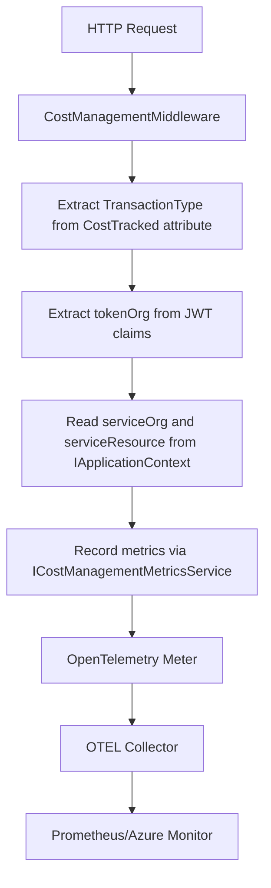

# Cost Management Metrics

This document describes the implementation of cost management metrics in Dialogporten as specified in [Issue #2376](https://github.com/Altinn/dialogporten/issues/2376).

## Overview

The cost management metrics system tracks dialog transactions for billing and cost analysis purposes. It records metrics for all HTTP requests (2xx, 4xx, and 5xx status codes) with detailed metadata about the organization making the request and the service being accessed.

## Architecture

### Components

1. **`[CostTracked]` Attribute**: Custom attribute that marks endpoints for cost tracking and specifies the transaction type
2. **`CostManagementMiddleware`**: ASP.NET Core middleware that intercepts requests and records metrics
3. **`ICostManagementMetricsService`**: Service interface for recording transaction metrics
4. **`CostManagementMetricsService`**: Implementation that emits OpenTelemetry metrics
5. **`IApplicationContext`**: Scoped service for passing metadata from handlers to middleware
6. **`TransactionType`**: Enum defining all supported transaction types

### Data Flow



## Transaction Types

The system tracks various transaction types defined in the `TransactionType` enum:

| Transaction Type | Description | Norwegian Term |
|------------------|-------------|----------------|
| `CreateDialog` | Create dialog operation | Opprette dialog |
| `UpdateDialog` | Update dialog operation | Oppdatere dialog |
| `SoftDeleteDialog` | Soft delete dialog operation | Softslette dialog |
| `HardDeleteDialog` | Hard delete/purge dialog operation | Hardslette dialog |
| `GetDialogServiceOwner` | Get dialog by service owner | Hente dialog tjenesteeier |
| `SearchDialogsServiceOwner` | Service owner search dialogs | Tjenesteeiersøk |
| `GetDialogEndUser` | Get dialog by end user | Hente dialog sluttbruker |
| `SearchDialogsEndUser` | End user search dialogs | Sluttbrukersøk |
| `SetDialogLabel` | Set label on dialog | Sette label på dialog |
| `BulkSetLabelsServiceOwner` | Bulk set labels via service owner API | Bulk label setting tjenesteeier |
| `BulkSetLabelsEndUser` | Bulk set labels via end user API | Bulk label setting sluttbruker |

## Endpoint Annotation

Endpoints are marked for cost tracking using the `[CostTracked]` attribute:

```csharp
[CostTracked(TransactionType.CreateDialog)]
public class CreateDialogEndpoint : Endpoint<CreateDialogCommand, CreateDialogResult>
{
    // Endpoint implementation
}
```

## Metadata Structure

The system captures three key pieces of metadata for each transaction:

### 1. `tokenOrg` (Organization from JWT Token)
- **Source**: `"urn:altinn:org"` claim from the JWT token
- **Example**: `"digdir"`, `"skatteetaten"`
- **Purpose**: Identifies the organization making the API call

### 2. `serviceOrg` (Organization from Dialog Entity)
- **Source**: `dialog.Org` property from the dialog being operated on
- **Example**: `"digdir"`, `"skatteetaten"`
- **Purpose**: Identifies the organization that owns the service being accessed

### 3. `serviceResource` (Service Resource from Dialog Entity)
- **Source**: `dialog.ServiceResource` property from the dialog being operated on
- **Example**: `"skjema/NAV/123"`
- **Purpose**: Identifies the specific service resource being accessed

## Metadata Handling

### Handler Implementation

Handlers set metadata using `IApplicationContext`:

```csharp
public class CreateDialogCommandHandler : IRequestHandler<CreateDialogCommand, CreateDialogResult>
{
    private readonly IApplicationContext _applicationContext;
    
    public async Task<CreateDialogResult> Handle(CreateDialogCommand request, CancellationToken cancellationToken)
    {
        // ... business logic ...
        
        // Set metadata after successful operation
        _applicationContext.AddMetadata("serviceOrg", dialog.Org);
        _applicationContext.AddMetadata("serviceResource", dialog.ServiceResource);
        
        return result;
    }
}
```

### Special Cases

For operations where metadata cannot be meaningfully attributed:

```csharp
// Search operations affecting multiple entities
_applicationContext.AddMetadata("serviceOrg", CostManagementConstants.NoOrgValue);
_applicationContext.AddMetadata("serviceResource", CostManagementConstants.NoOrgValue);

// End user operations without organization context
_applicationContext.AddMetadata("serviceOrg", CostManagementConstants.NoOrgValue);
_applicationContext.AddMetadata("serviceResource", CostManagementConstants.NoOrgValue);
```

## Metrics Schema

### Counter Metric

- **Name**: `dialogporten_transactions_total`
- **Description**: Total number of dialog transactions for cost management
- **Type**: Counter (incremental)

### Tags

| Tag Name | Description | Example Values |
|----------|-------------|----------------|
| `transaction_type` | Type of transaction | `CreateDialog`, `GetDialogServiceOwner` |
| `token_org` | Organization from JWT token | `"digdir"`, `"skatteetaten"` |
| `service_org` | Organization from dialog entity | `"digdir"`, `"skatteetaten"`, `"null"` |
| `service_resource` | Service resource from dialog entity | `"skjema/NAV/123"`, `"null"` |
| `http_status_code` | HTTP response status code | `200`, `201`, `400`, `404`, `500` |
| `environment` | Environment name | `Development`, `Test`, `Production` |

## Implementation & Configuration

### Service Registration

In `Program.cs`:

```csharp
// Register services
builder.Services.AddScoped<IApplicationContext, ApplicationContext>();
builder.Services.AddSingleton<ICostManagementMetricsService, CostManagementMetricsService>();

// Add middleware
app.UseMiddleware<CostManagementMiddleware>();
```

### OpenTelemetry Integration

The cost management meter is automatically registered:

```csharp
metrics.AddMeter("Dialogporten.CostManagement");
```

### Endpoint Metadata

The middleware reads endpoint metadata to determine transaction types:

```csharp
var endpoint = context.GetEndpoint();
var costTrackedAttribute = endpoint?.Metadata.GetMetadata<CostTrackedAttribute>();
var transactionType = costTrackedAttribute?.TransactionType;
```

### JWT Claims Extraction

Organization information is extracted from JWT claims:

```csharp
private static string? ExtractTokenOrg(IUser user)
{
    var principal = user.GetPrincipal();
    if (principal.TryGetOrganizationShortName(out var orgShortName))
    {
        return orgShortName;
    }
    return null;
}
```
