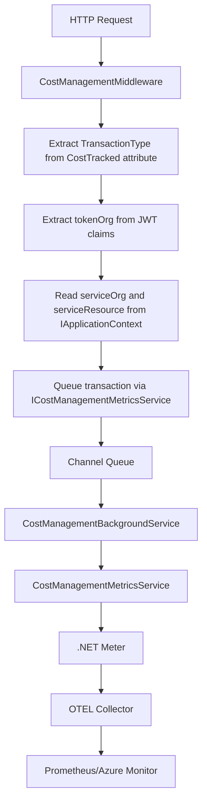

# Cost Management Metrics

This document describes the implementation of cost management metrics in Dialogporten as specified in [Issue #2376](https://github.com/Altinn/dialogporten/issues/2376).

## Overview

The cost management metrics system tracks dialog transactions for billing and cost analysis purposes. It records metrics only for endpoints explicitly annotated with the `[CostTracked]` attribute, covering both successful (2xx) and error (4xx) responses for those opted-in endpoints, along with detailed metadata about the organization making the request and the service being accessed.

## Architecture

### Components

1. **`[CostTracked]` Attribute**: Custom attribute that marks endpoints for cost tracking and specifies the transaction type
2. **`CostManagementMiddleware`**: ASP.NET Core middleware that intercepts requests and queues transactions
3. **`ICostManagementMetricsService`**: Service interface for queueing transaction metrics  
4. **`CostManagementService`**: Implementation that queues transactions for background processing
5. **`CostManagementBackgroundService`**: Background service that processes queued transactions
6. **`CostManagementMetricsService`**: Internal service that emits .NET Meter metrics
7. **`IApplicationContext`**: Scoped service for passing metadata from handlers to middleware
8. **`TransactionRecord`**: Record type for queuing transaction data
9. **`TransactionType`**: Enum defining all supported transaction types
10. **`CostManagementOptions`**: Configuration options for queue capacity, monitoring, and feature toggles
11. **`CostManagementConstants`**: Constants for metric names, tags, and status values
12. **`CostManagementMetadataKeys`**: Constants for IApplicationContext metadata keys

### Data Flow (Async Queue-Based)



## Transaction Types

The system tracks various transaction types defined in the `TransactionType` enum:

| Transaction Type | Description | Norwegian Term |
|------------------|-------------|----------------|
| `CreateDialog` | Create dialog operation | Opprette dialog |
| `UpdateDialog` | Update dialog operation | Oppdatere dialog |
| `SoftDeleteDialog` | Soft delete dialog operation | Softslette dialog |
| `HardDeleteDialog` | Hard delete/purge dialog operation | Hardslette dialog |
| `GetDialogServiceOwner` | Get dialog by service owner | Hente dialog tjenesteeier |
| `SearchDialogsServiceOwner` | Service owner search dialogs | Tjenesteeiersøk |
| `GetDialogEndUser` | Get dialog by end user | Hente dialog sluttbruker |
| `SearchDialogsEndUser` | End user search dialogs | Sluttbrukersøk |
| `SetDialogLabel` | Set label on dialog | Sette label på dialog |
| `BulkSetLabelsServiceOwner` | Bulk set labels via service owner API | Bulk label setting tjenesteeier |
| `BulkSetLabelsEndUser` | Bulk set labels via end user API | Bulk label setting sluttbruker |

## Endpoint Annotation

Endpoints are marked for cost tracking using the `[CostTracked]` attribute:

```csharp
[CostTracked(TransactionType.CreateDialog)]
public class CreateDialogEndpoint : Endpoint<CreateDialogCommand, CreateDialogResult>
{
    // Endpoint implementation
}
```

## Metadata Structure

The system captures three key pieces of metadata for each transaction:

### 1. `tokenOrg` (Organization from JWT Token)
- **Source**: `"urn:altinn:org"` claim from the JWT token
- **Example**: `"digdir"`, `"skatteetaten"`
- **Purpose**: Identifies the organization making the API call

### 2. `serviceOrg` (Organization from Dialog Entity)
- **Source**: `dialog.Org` property from the dialog being operated on
- **Example**: `"digdir"`, `"skatteetaten"`
- **Purpose**: Identifies the organization that owns the service being accessed

### 3. `serviceResource` (Service Resource from Dialog Entity)
- **Source**: `dialog.ServiceResource` property from the dialog being operated on
- **Example**: `"skjema/NAV/123"`
- **Purpose**: Identifies the specific service resource being accessed

## Metadata Handling

### Handler Implementation

Handlers set metadata using `IApplicationContext`:

```csharp
public class CreateDialogCommandHandler : IRequestHandler<CreateDialogCommand, CreateDialogResult>
{
    private readonly IApplicationContext _applicationContext;
    
    public async Task<CreateDialogResult> Handle(CreateDialogCommand request, CancellationToken cancellationToken)
    {
        // ... business logic ...
        
        // Set metadata after successful operation
        _applicationContext.AddMetadata(CostManagementMetadataKeys.ServiceOrg, dialog.Org);
        _applicationContext.AddMetadata(CostManagementMetadataKeys.ServiceResource, dialog.ServiceResource);
        
        return result;
    }
}
```

### Special Cases

For operations where metadata cannot be meaningfully attributed:

```csharp
// Search operations affecting multiple entities
_applicationContext.AddMetadata(CostManagementMetadataKeys.ServiceOrg, CostManagementMetadataKeys.SearchOperation);
_applicationContext.AddMetadata(CostManagementMetadataKeys.ServiceResource, CostManagementMetadataKeys.SearchOperation);

// End user operations without organization context
_applicationContext.AddMetadata(CostManagementMetadataKeys.ServiceOrg, CostManagementMetadataKeys.NotApplicable);
_applicationContext.AddMetadata(CostManagementMetadataKeys.ServiceResource, CostManagementMetadataKeys.NotApplicable);
```

## Metrics Schema

### Counter Metric

- **Name**: `dialogporten_transactions_total`
- **Description**: Total number of dialog transactions for cost management
- **Type**: Counter (incremental)

### Tags

| Tag Name | Description | Example Values |
|----------|-------------|----------------|
| `transaction_type` | Type of transaction | `CreateDialog`, `GetDialogServiceOwner` |
| `token_org` | Organization from JWT token | `"digdir"`, `"skatteetaten"` |
| `service_org` | Organization from dialog entity | `"digdir"`, `"skatteetaten"`, `"unknown"`, `"search_operation"`, `"bulk_operation"`, `"not_applicable"` |
| `service_resource` | Service resource from dialog entity | `"skjema/NAV/123"`, `"unknown"`, `"search_operation"`, `"bulk_operation"`, `"not_applicable"` |
| `http_status_code` | HTTP response status code | `200`, `201`, `400`, `404` |
| `environment` | Environment name | `Development`, `Test`, `Production` |

### Monitoring Metrics

Additional metrics for queue health monitoring:

| Metric Name | Type | Description | 
|-------------|------|-------------|
| `dialogporten_cost_queue_depth` | Gauge | Current number of transactions waiting in queue |
| `dialogporten_cost_dropped_transactions_total` | Counter | Total transactions dropped due to queue overflow |

## Implementation & Configuration

### Configuration Options

Cost management can be configured via `appsettings.json`:

```json
{
  "CostManagement": {
    "Enabled": true,
    "QueueCapacity": 100000,
    "EnableQueueMonitoring": true
  }
}
```

### Configuration Properties

| Property | Description | Default | Recommended Values |
|----------|-------------|---------|-------------------|
| `Enabled` | Whether cost tracking is enabled | `true` | `false` for development, `true` for production |
| `QueueCapacity` | Maximum queued transactions | `100,000` | Dev: 1,000; Test: 10,000; Prod: 100,000-500,000 |
| `EnableQueueMonitoring` | Whether to enable queue monitoring metrics | `true` | `true` for production monitoring |

### Queue Capacity Planning

For **high-traffic scenarios** (tax returns, deadlines):

- **5M users, 3-5 API calls each** = 15-25M transactions
- **Peak window: 2-3 hours** = ~2,000-4,000 TPS sustained  
- **Burst capacity needed**: 10,000+ TPS for spikes
- **Queue buffer recommendations**:
  - **100,000 capacity** ≈ 25 seconds at 4,000 TPS
  - **500,000 capacity** ≈ 2 minutes at 4,000 TPS
  - **Memory impact**: ~200MB for 1M capacity (acceptable)

### Service Registration

In `Program.cs`:

```csharp
// Register services with configuration
builder.Services.AddScoped<IApplicationContext, ApplicationContext>();
builder.Services.AddCostManagementMetrics(builder.Configuration);

// Add middleware
app.UseCostManagementMetrics();
```

### OpenTelemetry Integration

The cost management meter is automatically registered:

```csharp
metrics.AddMeter("Dialogporten.CostManagement");
```

### Endpoint Metadata

The middleware reads endpoint metadata to determine transaction types:

```csharp
var endpoint = context.GetEndpoint();
var costTrackedAttribute = endpoint?.Metadata.GetMetadata<CostTrackedAttribute>();
var transactionType = costTrackedAttribute?.TransactionType;
```

### JWT Claims Extraction

Organization information is extracted from JWT claims:

```csharp
private static string? ExtractTokenOrg(IUser user)
{
    var principal = user.GetPrincipal();
    if (principal.TryGetOrganizationShortName(out var orgShortName))
    {
        return orgShortName;
    }
    return null;
}
```
