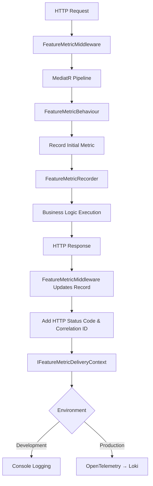

# Feature Metrics Tracking System

This document describes the implementation of the Feature Metrics tracking system in Dialogporten for comprehensive transaction monitoring and cost management.

## Overview

The Feature Metrics system automatically tracks all transactions across the application layer, providing detailed logging for cost management, auditing, and operational monitoring. FeatureMetrics captures every MediatR request with full context including HTTP status codes, correlation IDs, and resource information.

## Architecture

### Components

1. **`FeatureMetricBehaviour`**: MediatR pipeline behavior that automatically records all requests
2. **`FeatureMetricMiddleware`**: HTTP middleware that adds presentation layer context (status codes, correlation IDs)
3. **`FeatureMetricRecorder`**: Thread-safe service that manages metric records and updates
4. **`FeatureMetricRecord`**: Immutable record containing all transaction metadata
5. **`IFeatureMetricDeliveryContext`**: Interface for different logging delivery mechanisms
6. **`LoggingFeatureMetricDeliveryContext`**: Console-based logging for development
7. **`OtelFeatureMetricLoggingDeliveryContext`**: OpenTelemetry-based logging for production
8. **`IDialogIdQuery`**: Marker interface for dialog-based operations
9. **`IServiceResourceResolver<T>`**: Interface for resolving service resource information
10. **`FeatureMetricConstants`**: Constants for unknown values and fallbacks

### Data Flow



## Automatic Coverage

The system automatically tracks **all MediatR requests** without requiring explicit annotations:

### Covered Operations
- ✅ **Dialog Operations**: Create, Update, Delete, Restore, Purge
- ✅ **Query Operations**: Get, Search (both ServiceOwner and EndUser)
- ✅ **Label Operations**: Set, BulkSet (both ServiceOwner and EndUser)
- ✅ **Activity Operations**: GetActivity, SearchActivities
- ✅ **Transmission Operations**: GetTransmission, SearchTransmissions
- ✅ **Seen Log Operations**: GetSeenLog, SearchSeenLogs
- ✅ **Resource Registry Operations**: SyncSubjectMap
- ✅ **Service Owner Context Operations**: Update, GetLabels

### HTTP Status Code Coverage
- ✅ **2xx Success**: All successful operations
- ✅ **4xx Client Errors**: Validation failures, not found, etc.
- ✅ **5xx Server Errors**: Internal errors, exceptions

## Data Structure

### FeatureMetricRecord

```csharp
public sealed record FeatureMetricRecord(
    string FeatureName,           // MediatR request type name
    string Environment,           // Environment name (Development, Production, etc.)
    string? PerformerOrg,         // Organization from JWT token
    string? OwnerOrg,             // Organization owning the service
    string? ServiceResource,      // Specific service resource identifier
    int? HttpStatusCode,          // HTTP response status code
    string? PresentationTag,      // HTTP method + path for grouping
    string? Audience,             // "ServiceOwner" or "EndUser"
    string? CorrelationId         // Unique ID per HTTP request
);
```

### Example Record

```
FeatureType=UpdateDialogCommand
Environment=Development
TokenOrg=digdir
ServiceOrg=ttd
ServiceResource=urn:altinn:resource:super-simple-service
HttpStatusCode=204
PresentationTag=PATCH_api_v1_serviceowner_dialogs_01993436-4f89-726d-bf75-9c8dd4775b0c
Audience=ServiceOwner
CorrelationId=0HNFIV981U5ND:00000001
Success=True
```

## Resource Resolution

The system uses two approaches for determining service resource information:

### 1. IDialogIdQuery Interface

For operations that work with a specific dialog:

```csharp
public interface IDialogIdQuery
{
    Guid DialogId { get; }
}
```

**Used by**: GetDialogQuery, UpdateDialogCommand, DeleteDialogCommand, etc.

### 2. IServiceResourceResolver<T> Interface

For operations that need custom resource resolution:

```csharp
public interface IServiceResourceResolver<TRequest>
{
    Task<ServiceResourceInformation?> Resolve(TRequest request, CancellationToken cancellationToken);
}
```

**Used by**: Search operations, bulk operations, special cases

### 3. Search Operations

Search operations use a sentinel value since they affect multiple dialogs:

```csharp
// In search resolvers
return new ServiceResourceInformation("search_operation", "search_operation");
```

### 4. Bulk Operations

Bulk operations also use a sentinel value since they affect multiple dialogs:

```csharp
// In bulk operation resolvers (e.g., BulkSetSystemLabelCommand)
return new ServiceResourceInformation("bulk_operation", "bulk_operation");
```

**Used by**: BulkSetSystemLabelCommand (both ServiceOwner and EndUser variants)

## Correlation and Grouping

### Correlation IDs

Each HTTP request gets a unique correlation ID using `HttpContext.TraceIdentifier`:

- **Format**: `{ActivityId}:{SequenceNumber}` (e.g., `0HNFIV981U5ND:00000001`)
- **Purpose**: Groups all MediatR operations from the same HTTP request
- **Cost Management**: Enables accurate counting of endpoint calls

### Presentation Tags

Generated from HTTP method and path for endpoint identification:

- **Format**: `{METHOD}_{path_with_underscores}` 
- **Example**: `PATCH_api_v1_serviceowner_dialogs_01993436-4f89-726d-bf75-9c8dd4775b0c`
- **Purpose**: Identifies which endpoint triggered the operations

### Example: PATCH Dialog Endpoint

A single PATCH call generates multiple correlated records:

```
GetDialogQuery    → CorrelationId=abc123, PresentationTag=PATCH_...
UpdateDialogCommand → CorrelationId=abc123, PresentationTag=PATCH_...
```

**Cost Management Query**:
```sql
SELECT COUNT(DISTINCT CorrelationId) as EndpointCalls
FROM FeatureMetrics 
WHERE PresentationTag LIKE 'PATCH_%'
```

## Logging and Delivery

### Environment-Based Delivery

The system automatically selects the appropriate delivery mechanism:

```csharp
var otelEndpoint = configuration["OTEL_EXPORTER_OTLP_ENDPOINT"];
if (string.IsNullOrEmpty(otelEndpoint)) {
    // Development: Console logging
    services.AddScoped<IFeatureMetricDeliveryContext, LoggingFeatureMetricDeliveryContext>();
} else {
    // Production: OpenTelemetry logging
    services.AddScoped<IFeatureMetricDeliveryContext, OtelFeatureMetricLoggingDeliveryContext>();
}
```

### Structured Logging

Both delivery contexts use `[LoggerMessage]` attributes for efficient, structured logging:

```csharp
[LoggerMessage(
    EventId = 1000,
    Level = LogLevel.Information,
    Message = "Feature Metric Recorded: " +
              "FeatureType={FeatureType}, Environment={Environment}, " +
              "TokenOrg={TokenOrg}, ServiceOrg={ServiceOrg}, " +
              "ServiceResource={ServiceResource}, HttpStatusCode={HttpStatusCode}, " +
              "PresentationTag={PresentationTag}, Audience={Audience}, " +
              "CorrelationId={CorrelationId}, Success={Success}")]
private static partial void LogFeatureMetric(...);
```

### Log Destinations

- **Development**: Console output with immediate visibility
- **Production**: Structured logging through OpenTelemetry

## Configuration

### Service Registration

```csharp
// In ApplicationExtensions.cs
services
    .AddScoped(typeof(IPipelineBehavior<,>), typeof(FeatureMetricBehaviour<,>))
    .AddScoped<FeatureMetricRecorder>()
    .AddServiceResourceResolvers(thisAssembly); // Auto-registers all resolvers
```

### Middleware Registration

```csharp
// In Program.cs - must be after all endpoint processing
app.UseFeatureMetrics();
```

### Environment Configuration

```json
{
  "OTEL_EXPORTER_OTLP_ENDPOINT": "http://localhost:4317"
}
```

## Cost Management Usage

### Counting Endpoint Calls

```sql
-- Count unique endpoint calls (one per HTTP request)
SELECT COUNT(DISTINCT CorrelationId) as TransactionCount
FROM FeatureMetrics 
WHERE PresentationTag LIKE 'PATCH_%'
```

### Grouping Operations by Request

```sql
-- See all operations per endpoint call
SELECT CorrelationId, COUNT(*) as OperationsPerCall
FROM FeatureMetrics 
GROUP BY CorrelationId
```

### Filtering by Success/Failure

```sql
-- Count successful vs failed operations
SELECT 
    CASE WHEN HttpStatusCode BETWEEN 200 AND 299 THEN 'Success' ELSE 'Failed' END as Status,
    COUNT(*) as Count
FROM FeatureMetrics 
GROUP BY Status
```

## Thread Safety

The system uses thread-safe operations with `System.Threading.Lock`:

```csharp
private readonly Lock _lock = new();

public void UpdateRecord(int httpStatusCode, string presentationTag, string correlationId)
{
    lock (_lock)
    {
        var newRecords = _records.Select(r => r with
        {
            HttpStatusCode = httpStatusCode,
            PresentationTag = presentationTag,
            CorrelationId = correlationId
        }).ToList();
        _records = newRecords;
    }
}
```

## Architectural Notes

### Clean Architecture Violation

The `FeatureMetricMiddleware` directly accesses the concrete `FeatureMetricRecorder` class, violating clean architecture principles. This is a pragmatic solution due to:

- **Middleware execution timing**: Middleware runs before MediatR behaviors
- **Instance sharing**: Need to update the same instance that the behavior populates
- **Alternative complexity**: Proper interface-based solution would require significant architectural changes

### Performance Considerations

- **Automatic recording**: All MediatR requests are recorded (no opt-in required)
- **Efficient logging**: Uses `[LoggerMessage]` for compile-time optimization
- **Thread-safe**: Minimal locking overhead with immutable record updates
- **Memory efficient**: Records are immutable and can be garbage collected immediately after logging

## Key Features

### Comprehensive Coverage
- ✅ Automatic coverage of all MediatR requests
- ✅ HTTP status code inclusion (including 5xx server errors)
- ✅ Correlation ID grouping for accurate endpoint call counting
- ✅ Audience classification (ServiceOwner/EndUser)
- ✅ Structured logging with OpenTelemetry integration
- ✅ Thread-safe immutable record updates
