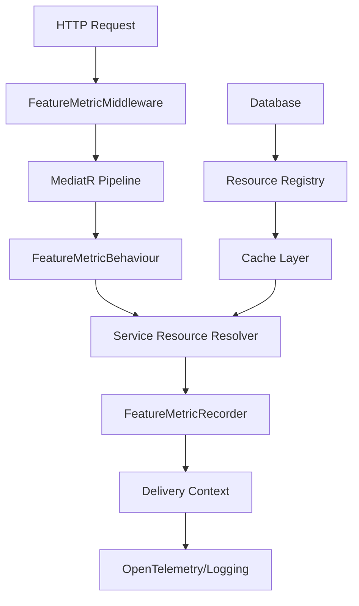

# Feature Metrics System

The Feature Metrics system tracks usage of application features to enable cost management, performance monitoring, and business intelligence. It automatically captures metrics for all MediatR requests and HTTP endpoints.

## Overview

The system consists of several components that work together to collect, process, and deliver feature usage metrics:

1. **Collection Layer** - Captures feature usage data
2. **Processing Layer** - Resolves service resource information
3. **Delivery Layer** - Sends metrics to monitoring systems
4. **Caching Layer** - Optimizes performance for resource lookups

## Architecture



## Components

### 1. Collection Layer

#### FeatureMetricBehaviour
- **Location**: `src/Digdir.Domain.Dialogporten.Application/Common/Behaviours/FeatureMetric/FeatureMetricBehaviour.cs`
- **Purpose**: MediatR pipeline behavior that captures feature usage for each request
- **Data Collected**:
  - Feature name (request type)
  - Environment
  - Performer organization
  - Owner organization
  - Service resource ID

#### FeatureMetricMiddleware
- **Location**: `src/Digdir.Domain.Dialogporten.WebApi/Common/FeatureMetric/FeatureMetricMiddleware.cs`
- **Purpose**: HTTP middleware that captures endpoint-level metrics
- **Data Collected**:
  - Presentation tag (HTTP method + route)
  - HTTP status code
  - Correlation ID
  - Success/failure status

### 2. Processing Layer

#### Service Resource Resolvers
The system uses different resolvers based on request type:

- **`IFeatureMetricServiceResourceThroughDialogIdRequest`** - For requests with DialogId
- **`IFeatureMetricServiceResourceRequest`** - For requests with no DialogId but with ServiceResource property
- **`IFeatureMetricServiceResourceIgnoreRequest`** - For requests that don't need tracking

#### Caching
- **Cache Type**: FusionCache with Redis + Memory cache
- **Configuration**: 5-minute duration
- **Purpose**: Optimizes service resource lookups

### 3. Delivery Layer

#### Delivery Contexts
Two delivery mechanisms based on environment:

**Development (Console Logging)**:
- Uses `LoggingFeatureMetricDeliveryContext`
- Outputs structured logs to console
- Immediate visibility for debugging

**Production (OpenTelemetry)**:
- Uses `OtelFeatureMetricLoggingDeliveryContext`
- Sends metrics to OpenTelemetry collector
- Integrates with monitoring infrastructure

### 4. Data Model

#### FeatureMetricRecord
```csharp
public sealed record FeatureMetricRecord(
    string FeatureName,           // Full type name of the request
    string? Environment,          // Environment name (dev/staging/prod)
    string? CallerOrg,            // Organization performing the action
    string? OwnerOrg,             // Organization owning the resource
    string? ServiceResource)      // Resource being accessed
```

#### Presentation Tags
Format: `{HTTP_METHOD}_{route_template}`
Examples:
- `GET_api_v1_dialogs_{dialogId}`
- `POST_api_v1_serviceowner_dialogs`
- `PATCH_api_v1_enduser_dialogs_{dialogId}`

## Configuration

### Service Registration
```csharp
// In ApplicationExtensions.cs
services
    .AddScoped(typeof(IPipelineBehavior<,>), typeof(FeatureMetricBehaviour<,>))
    .AddScoped<FeatureMetricRecorder>()
    .AddServiceResourceResolvers(thisAssembly);
```

### Middleware Registration
```csharp
// In Program.cs - must be after all endpoint processing
app.UseFeatureMetrics();
```

### Cache Configuration
```csharp
// In InfrastructureExtensions.cs
.ConfigureFusionCache(nameof(IFeatureMetricServiceResourceCache), new()
{
    Duration = TimeSpan.FromMinutes(5)
});
```

## Usage Patterns

### Adding New Requests
All MediatR requests must implement one of the feature metric interfaces:

```csharp
// For requests with DialogId
public sealed class GetDialogQuery : IRequest<DialogDto>, 
    IFeatureMetricServiceResourceThroughDialogIdRequest
{
    public Guid DialogId { get; set; }
}

// For requests with no DialogId but with ServiceResource property
public sealed class SearchDialogQuery : IRequest<SearchResult>, 
    IFeatureMetricServiceResourceRequest
{
    public string ServiceResource { get; set; }
}

// For requests that don't need tracking
public sealed class GetJwksQuery : IRequest<JwksDto>, 
    IFeatureMetricServiceResourceIgnoreRequest
{
}
```

### Service Resource Resolution
The system automatically resolves service resource information:

1. **Through DialogId**: Looks up dialog → service resource → organization info
2. **Direct ServiceResource**: Uses resource registry to get organization info
3. **Ignore**: Skips resource resolution entirely

## Monitoring and Observability

### Metrics Collected
- **Feature Usage**: Which features are being used and how often
- **Organization Attribution**: Which organizations are using which resources
- **Performance**: Success/failure rates per feature
- **Correlation**: Grouping operations by HTTP request

### Query Examples

#### Count Endpoint Calls
```sql
SELECT COUNT(DISTINCT CorrelationId) as EndpointCalls
FROM FeatureMetrics 
WHERE PresentationTag LIKE 'GET_%'
```

#### Feature Usage by Organization
```sql
SELECT CallerOrg, COUNT(*) as UsageCount
FROM FeatureMetrics
WHERE FeatureName = 'GetDialogQuery'
GROUP BY CallerOrg
```

#### Success Rate by Feature
```sql
SELECT 
    FeatureName,
    COUNT(CASE WHEN Status = 'success' THEN 1 END) as SuccessCount,
    COUNT(*) as TotalCount,
    (COUNT(CASE WHEN Status = 'success' THEN 1 END) * 100.0 / COUNT(*)) as SuccessRate
FROM FeatureMetrics 
GROUP BY FeatureName
```
